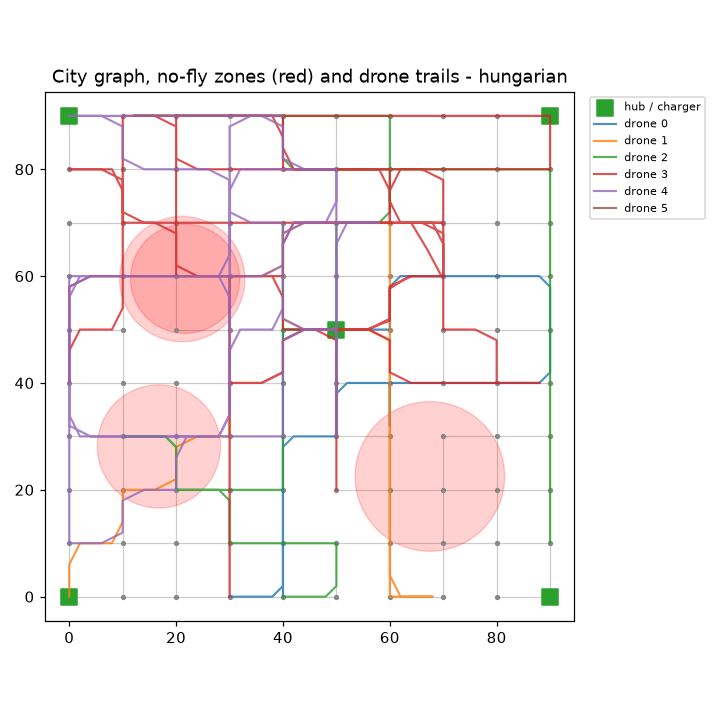
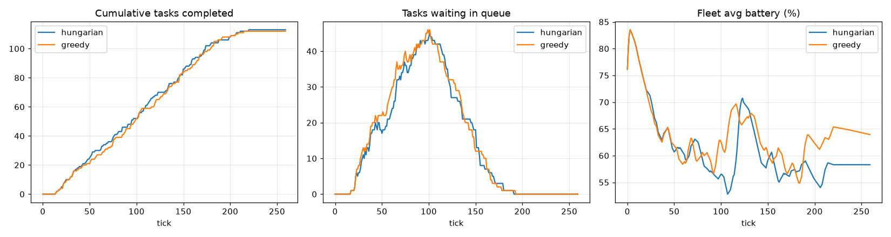
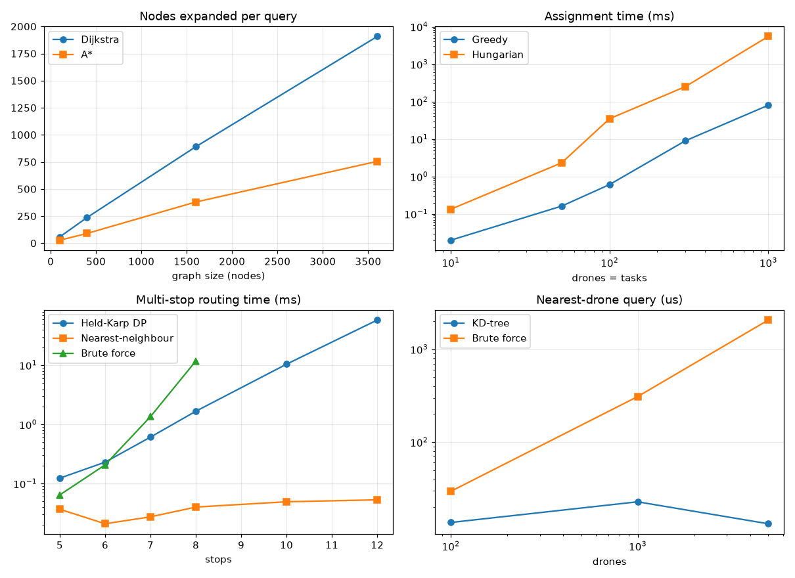
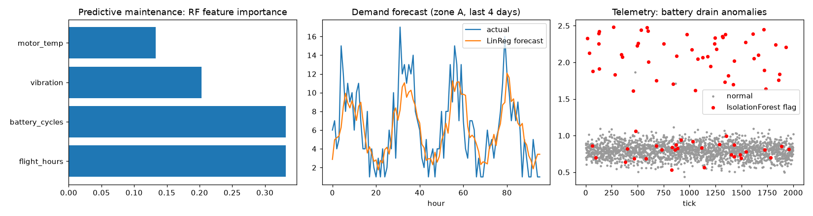

# Intelligent Drone Fleet Management System - Final Report

_Generated: 2026-09-19T10:56:38_

_Runtime: **11.3 s** | Seed: `42` | Drones: **24** | Tasks: **110** | Horizon: 120 ticks | Simulation ticks: 260 | No-fly events: 3_

## 1. Synthetic Data

- City graph: **100** waypoints, **167** corridors
- Charging hubs: `[0, 9, 55, 90, 99]`
- Fleet: 24 drones | Tasks: 110 over 120 ticks
- Floyd-Warshall all-pairs table: O(n^3) precomputed for O(1) dispatch cost lookups

## 2. DSA Showcase

**Pathfinding (node 0 -> 99)**
- Dijkstra: cost `203.728`, expanded `100` nodes
- A*: cost `203.728`, expanded `96` nodes
- Floyd-Warshall: cost `203.728` - all three agree: **True**
- A* path: `[0, 10, 11, 21, 22, 32, 33, 43, 53, 63, 64, 74, 75, 76, 86, 96, 97, 98, 99]`
- A* re-route with 3 blocked nodes: `[0, 10, 20, 30, 40, 50, 60, 61, 62, 63, 64, 74, 75, 76, 86, 96, 97, 98, 99]`

**Spatial index**
- KD-tree 3-NN to (33, 47): `[(4.2, 53), (7.6, 43), (7.6, 54)]`

**Assignment (toy 4x4)**
- Hungarian: `([(1, 0), (0, 1), (2, 2), (3, 3)], 13.0)`
- Greedy: `([(0, 1), (1, 2), (2, 0), (3, 3)], 14.0)`

**Multi-stop routing (6 stops, start=0)**
- Held-Karp DP: cost `307.397`, order `[0, 12, 71, 94, 58, 37]`
- Brute force: cost `307.397`
- Nearest-neighbour: cost `307.397`
- Constrained (battery + deadline): cost `307.397`, order `[0, 12, 71, 94, 58, 37]`, explored `91` states

**Other structures**
- Heap task queue pop order (priority, deadline): `[(4, 51), (4, 116), (3, 70), (3, 99), (1, 66), (1, 78)]`
- AVL tree: height 4 | keys >= 60% battery: `[(63, 4), (71, 5), (88, 0), (97, 2)]`
- Reservation table: corridor free at t=12? `False` | at t=15? `True`
- Union-Find groups: `[[0, 1, 2], [3], [4, 5]]`
- Trie prefix 'd': `['delta-hub', 'depot-north', 'drone-01', 'drone-02']`
- Merge sort by -x: `[9, 5, 2, 1]`

## 3. Machine Learning

**Predictive maintenance (RandomForest, 3000 synthetic flights)**
- accuracy `0.898` | F1 `0.778`
- feature importances: `{'flight_hours': 0.332, 'battery_cycles': 0.332, 'vibration': 0.203, 'motor_temp': 0.133}`
- drones with P(maintenance) > 0.85 -> grounded: `[5, 7, 18]`

**Anomaly detection (2000 telemetry ticks)**
- IsolationForest: precision `0.975` | recall `0.94`
- Sliding-window z-score: precision `0.963` | recall `1`

**Demand forecast (LinearRegression on lags)**
- MAE `1.876` | RMSE `2.378`
- naive lag-1 MAE `2.427` | naive lag-24 MAE `2.323`
- next-hour predicted demand per zone: `{'A': 2.8, 'B': 1.7, 'C': 2.3, 'D': 2.2}`
- pre-positioned drones: `{'A': 7, 'B': 5, 'C': 6, 'D': 6}`

## 4. NLP Command Parser

- `Send 2 drones to sector B and return when battery hits 20%`
    -> `dispatch {'count': 2, 'sector': 'B', 'return_battery': 20}`
- `deliver 3.5 kg from sector A to node 77 priority 4`
    -> `deliver {'from': ('sector', 'A'), 'to': ('node', 77), 'priority': 4, 'weight': 3.5}`
- `inspect sector C with three drones`
    -> `dispatch {'count': 3, 'sector': 'C'}`
- `recall all drones`
    -> `recall {'drone_id': None}`
- `block sector D for 30 ticks`
    -> `nofly {'sector': 'D', 'duration': 30}`
- `juggle the drones`
    -> `PARSE ERROR (could not understand: 'juggle the drones')`

## 5. Simulation (Hungarian vs Greedy)

**Strategy comparison (identical scenario, seeded)**

| metric | hungarian | greedy |
|---|---|---|
| `tasks_total` | 113 | 113 |
| `completed` | 113 | 112 |
| `completion_rate_%` | 100.0 | 99.1 |
| `late` | 41 | 39 |
| `avg_turnaround_ticks` | 57.3 | 59.6 |
| `avg_battery_reserve_%` | 50.2 | 48.6 |
| `fleet_distance` | 15186 | 16224 |
| `distance_per_task` | 134.4 | 144.9 |
| `validator_rejections` | 39 | 26 |
| `replans` | 10 | 11 |
| `hold_ticks` | 77 | 29 |
| `crashed` | 0 | 0 |
| `proximity_events` | 69 | 59 |
| `astar_nodes_expanded` | 5269 | 5824 |
| `dispatch_time_s` | 0.019 | 0.031 |

**Rejection breakdown (Hungarian):** `{'no_path': 24, 'airspace_conflict': 13, 'cmd:bad_drone_count': 1, 'cmd:unparseable': 1}`

**NLP commands executed during the Hungarian run:**
  - [t=20] 'send 2 drones to sector B and return when battery hits 20%' -> APPROVED: 2 patrol task(s) queued for sector B, return threshold 20%
  - [t=30] 'deliver a 2 kg package from node 5 to node 88 priority 5' -> APPROVED: delivery 5->88 priority 5 queued
  - [t=45] 'recall drone 3' -> APPROVED: 1 drone(s) recalled to nearest hub
  - [t=50] 'what is the status of drone 3' -> drone 3: to_hub, battery 34%, node 66, done 2
  - [t=55] 'send 99 drones to sector A' -> REJECTED by safety validator ['bad_drone_count']  [dispatch {'count': 99, 'sector': 'A'}]
  - [t=60] 'close sector D for 15 ticks' -> APPROVED: no-fly zone over sector D for 15 ticks
  - [t=61] 'make me a sandwich' -> REJECTED (parse error: could not understand: 'make me a sandwich')

## 6. Fleet Analysis (end of Hungarian run)

- Swarm clusters (Union-Find, radius 25): `[[0, 3, 13, 19], [1, 4, 14, 15, 16, 20, 21, 23], [2, 6, 9, 12, 17, 22], [5, 7, 8, 18], [10], [11]]`
- Radio channels needed (Welsh-Powell colouring): `4`
- Merged no-fly regions: `3`
- Top drones (id, tasks done, battery): `[(3, 9, 58), (20, 8, 61), (12, 8, 57)]`

## 7. Benchmarks (Big-O verified empirically)

### Pathfinding - Dijkstra vs A*

| nodes | dij_ms | astar_ms | dij_expanded | astar_expanded |
|---|---|---|---|---|
| 100 | 0.056 | 0.048 | 58.075 | 27.525 |
| 400 | 0.466 | 0.288 | 236.325 | 89.625 |
| 1600 | 2.063 | 0.952 | 890.375 | 380 |
| 3600 | 4.087 | 1.716 | 1907.975 | 755.25 |

### Assignment - Greedy vs Hungarian

| n | greedy_cost | hung_cost | greedy_ms | hung_ms |
|---|---|---|---|---|
| 10 | 257.297 | 199.424 | 0.02 | 0.133 |
| 50 | 416.435 | 215.252 | 0.162 | 2.323 |
| 100 | 598.697 | 265.421 | 0.608 | 34.802 |
| 300 | 886.179 | 444.958 | 8.951 | 249.94 |
| 1000 | 1634.831 | 1168.49 | 79.781 | 5482.364 |

### Multi-stop routing - Held-Karp vs brute force vs nearest-neighbour

| stops | dp_ms | brute_ms | nn_ms | dp_cost | nn_cost | nn_gap_% |
|---|---|---|---|---|---|---|
| 5 | 0.124 | 0.064 | 0.037 | 153.529 | 153.529 | 0 |
| 6 | 0.23 | 0.208 | 0.021 | 196.898 | 196.898 | 0 |
| 7 | 0.61 | 1.353 | 0.028 | 244.904 | 282.554 | 15.373 |
| 8 | 1.667 | 11.776 | 0.04 | 272.993 | 279.937 | 2.544 |
| 10 | 10.394 | n/a | 0.049 | 321.991 | 355.415 | 10.38 |
| 12 | 57.822 | n/a | 0.053 | 249.413 | 268.055 | 7.474 |

### Spatial index - KD-tree vs brute force

| drones | build_ms | kd_query_us | brute_query_us |
|---|---|---|---|
| 100 | 0.438 | 13.622 | 29.463 |
| 1000 | 3.272 | 22.741 | 308.828 |
| 5000 | 13.981 | 13.191 | 2061.023 |

## 8. Generated Plots

### city_map.png

### sim_comparison.png

### benchmarks.png

### ml_results.png

## 9. Output Files

- `output/city_map.png`
- `output/sim_comparison.png`
- `output/benchmarks.png`
- `output/ml_results.png`
- `output/final_report.md` 
- `output/final_report.txt`
